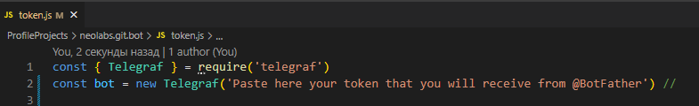

# Bot Horoscope

In this gothoscope you can get information about your sign and what awaits you today

__Built With__
- JavaScript
- Axios
- Telegraf
- Nodemon

__Install__

Use the git to clone the project to your local machine.

    git clone https://github.com/BEGIM-bem/-Bot-Horoscope.git

Navigate to the extracted folder

    cd -Bot-Horoscope

 __Install the dependencies and modules__    

     npm install   

In the new Telegraf field, put the token that you will receive from the telegrams of the @BotFather bot

__Usage__

      npm run dev    

